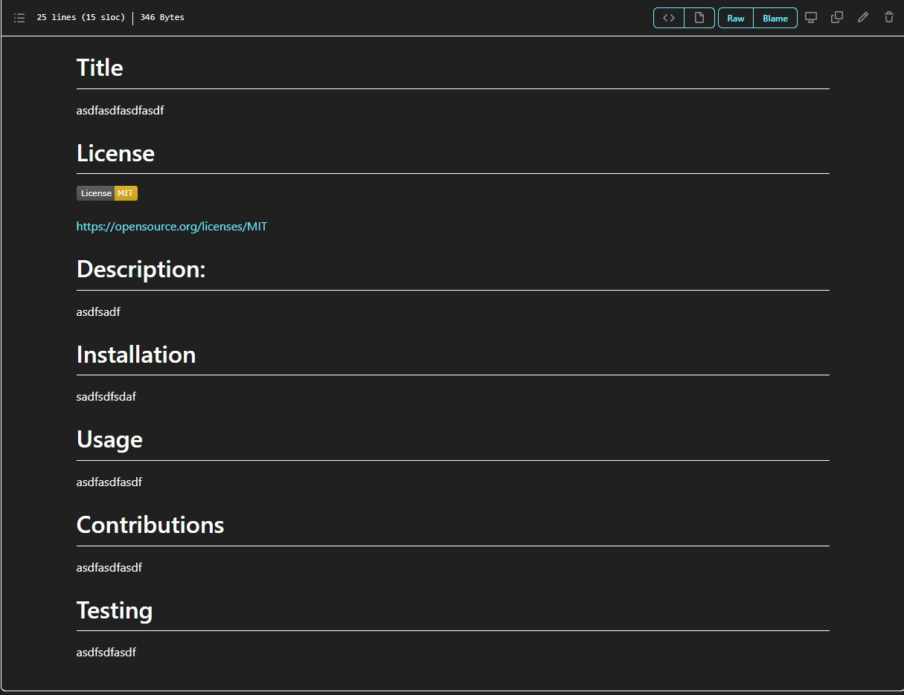
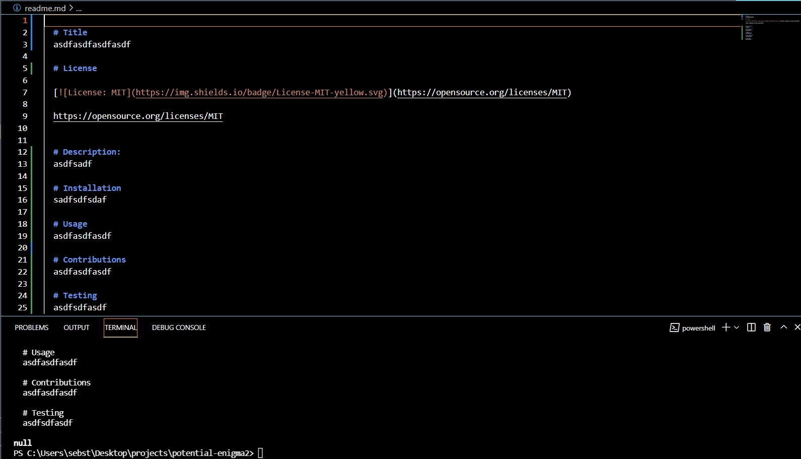

  # Title
  Potential Enigma

  # License
  
  

  http://creativecommons.org/publicdomain/zero/1.0/
  

  # Description:
  I was tasked with creating a readme generator for future projects. The readme should create a title, description, license, usage, installation, contributitor, and developer questions section that include github username and email address for the developer.

  # Installation:
  create a local file and use the "git clone git@github.com:RaiderNationBuilder/potential-enigma.git" command

  # Usage:
  run the app through Node.js in your terminal navigate to the root of the folder and use the command "node index.js". Then just answer the    questions. 
  
  

  # Contributions:
  Patrick Sebstead

  # Testing:
  follow the installation and usage instructions then you should see a readme.md file created in the root of your folder.

  # Questions:
  github username: RaiderNationBuilder

  If you have any questions about this project you can reach me at the following email address:
  sebstead@yahoo.com
